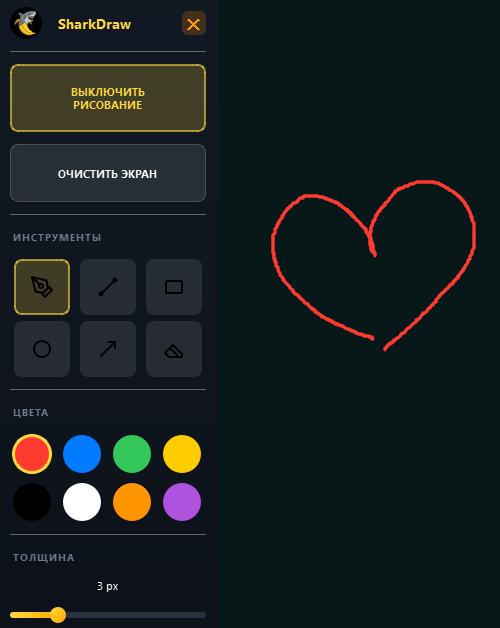

# PaintPro



Приложение для рисования поверх экрана Windows. Позволяет делать аннотации и рисовать поверх любых приложений, полезно для проведения уроков и презентаций.


## Возможности

- 🎨 **Инструменты рисования**: Карандаш, линия, прямоугольник, круг, стрелка
- 🧹 **Ластик** для удаления рисунков
- 🎨 **Палитра цветов**: 8 предустановленных цветов
- 📏 **Регулировка толщины** линии (1-10 px)
- ⌨️ **Горячие клавиши** для быстрого доступа
- 🪟 **Прозрачное окно** поверх всех приложений

## Установка

1. Установите Python 3.8 или выше
2. Установите зависимости:

```bash
pip install -r requirements.txt
```

## Запуск

```bash
python main.py
```

## Горячие клавиши

- `Ctrl+D` - Включить/выключить режим рисования
- `Ctrl+Shift+C` - Очистить экран
- `Esc` - Выход из приложения

## Использование

1. Запустите приложение
2. Появится панель инструментов (можно перетаскивать)
3. Нажмите `Ctrl+D` для включения режима рисования
4. Выберите инструмент и рисуйте поверх любых приложений
5. Нажмите `Ctrl+D` снова для выключения режима (клики будут проходить сквозь окно)

## Структура проекта

```
PaintPro/
├── main.py              # Точка входа
├── requirements.txt     # Зависимости
├── src/
│   ├── canvas.py       # Прозрачный холст
│   ├── tools.py        # Инструменты рисования
│   ├── toolbar.py      # Панель инструментов
│   ├── hotkeys.py      # Горячие клавиши
│   └── config.py       # Конфигурация
└── README.md
```

## Требования

- Windows 10/11
- Python 3.8+
- PyQt5
- keyboard

## Примечание

Для работы глобальных горячих клавиш может потребоваться запуск от имени администратора.
